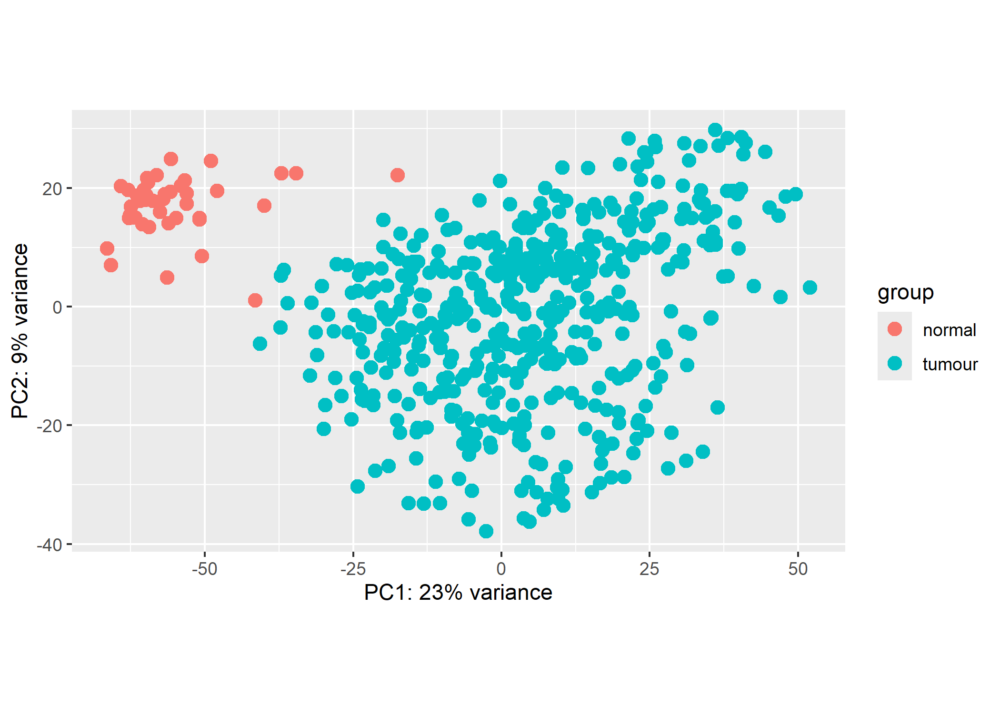
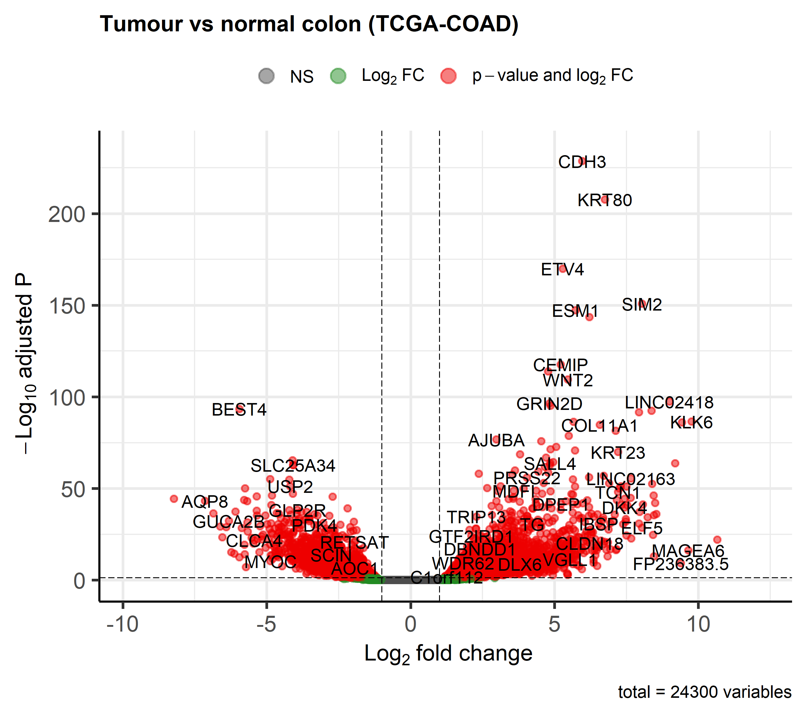
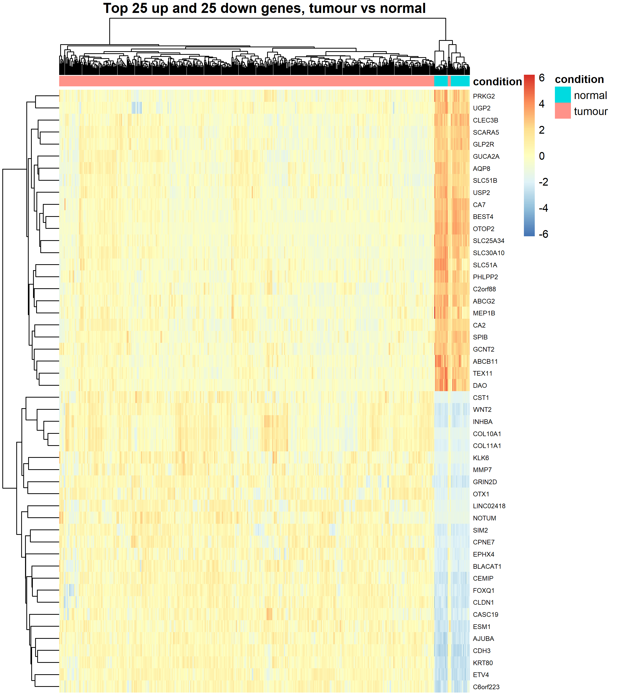

# Tumour vs Normal Gene Expression in Colon Cancer (TCGA-COAD)

## Aim
Identify genes differentially expressed between colon tumours and normal colon tissue, and test whether they relate to patient survival.

## Data
- Source: TCGA-COAD, via the NCI Genomic Data Commons (TCGAbiolinks)
- RNA-seq raw counts (STAR - Counts, unstranded)
- 481 primary tumours, 41 solid tissue normals
- Excluded: 1 metastatic and 1 recurrent sample (too few to analyse)
- Note: groups are unbalanced (481 vs 41), a known TCGA limitation

## Methods
1. **Download and preparation** (`scripts/01_download_data.R`): queried and downloaded STAR gene counts with TCGAbiolinks and merged them into one SummarizedExperiment (60,660 genes × 522 samples).
2. **Filtering and quality control** (`scripts/02_filter_pca.R`): kept genes with at least 10 reads in at least 41 samples (the size of the smallest group), leaving 24,300 genes. Counts were transformed with DESeq2's variance stabilising transformation (VST, blind to group), and the samples were checked by PCA on the 500 most variable genes.
3. **Differential expression** (`scripts/03_differential_expression.R`): DESeq2 with design `~ condition` (normal as reference). Genes were tested against a log2 fold change threshold of 1 (`lfcThreshold = 1`), with significance at Benjamini–Hochberg adjusted p < 0.05. Results were visualised with a volcano plot (EnhancedVolcano) and a heatmap of the top 25 up- and 25 down-regulated genes (pheatmap, row z-scores of VST counts).

## Results
### Quality control
Tumour and normal samples separate clearly along PC1 (23% of variance). Normals cluster tightly, while tumours are more heterogeneous, consistent with known colorectal cancer subtypes. No outliers were removed.

### Differential expression
**4,821 genes** were differentially expressed (|log2FC| > 1, padj < 0.05): **2,868 up-regulated** and **1,953 down-regulated** in tumours. The full list is in `results/deg_tumour_vs_normal.csv`.

- Top up-regulated genes include CDH3, KRT80, ETV4, SIM2, ESM1, FOXQ1, CEMIP, CLDN1 and WNT2, which point to Wnt signalling, invasion and angiogenesis.
- Down-regulated genes include markers of mature colon epithelium (GUCA2B, AQP8, CLCA4, BEST4, OTOP2, CA7), consistent with loss of normal differentiation in tumours.

## Tools
R 4.6.1, TCGAbiolinks, SummarizedExperiment, DESeq2 1.52.0, EnhancedVolcano 1.30.0, pheatmap 1.0.13

## Status
In progress: Phases 1–4 complete (setup, data, QC, differential expression). Next: pathway analysis and survival analysis.
